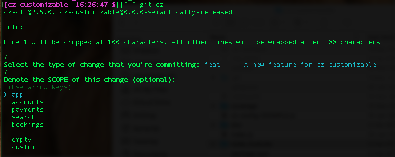

# cz-customizable

The customizable Commitizen plugin (or standalone utility) to help achieve consistent commit messages like the [AngularJS team](https://github.com/angular/angular.js/blob/master/CONTRIBUTING.md#-git-commit-guidelines). Note that you can create any commit message pattern. You don't have to use the pattern from the Angular team. For example, my team uses this pattern: `[minor] add new feature x`



Suitable for large teams working with multiple projects with their own commit scopes. It allows you to **select** the pre-defined scopes or commit types. It works perfectly with https://github.com/semantic-release/semantic-release.


[](http://commitizen.github.io/cz-cli/)
[](https://github.com/semantic-release/semantic-release)
[](https://www.npmjs.com/package/cz-customizable)
[](https://bundlephobia.com/package/cz-customizable)


You have two ways to use `cz-customizable`. Originally, this project started as a commitizen plugin (Option 1). We introduced the second option to run this `cz-customizable` in standalone mode (Option 2), just like any NodeJS script. It's recommended to use `Option 2` for simplicity. The way you configure is shared between both options.

# Quick start **(New, recommended)**
## Configuration

* Copy contents of [the example config file](./cz-config-EXAMPLE.js) and paste into a new file `.cz-config.js`
* move file `cz-config.js` to your home directory.

## cz-customizable via global install

`npm i cz-customizable -g`

Then run `cz-customizable` from your root repo. You can also use the alias `cz-cust`.

If everything is correct, you should see commit questions like the image above.

# Slow start

## Option 1 - cz-customizable via npx

`npx cz-customizable`


## Option 2 - cz-customizable in standalone mode

Use `cz-customizable` without `commitzen`.

* npm install `npm install cz-customizable --save-dev`
* add a new script to your `package.json`:

```
"scripts" : {
  ...
  "commit": "./node_modules/cz-customizable/standalone.js"
}
```

* See options below how to create and where you could put your `.cz-config.js` file.
* now run: `npm run commit`.


## Option 3 - cz-customizable as commitizen plugin

This is how this project started.

* install commitizen in case you don't have it: `npm install -g commitizen`. Make sure you have the latest version of commitizen installed globally.

* configure `commitizen` to use `cz-customizable` as plugin. Add those lines to your `package.json`:

```
...
"config": {
  "commitizen": {
    "path": "node_modules/cz-customizable"
  }
}
```


## Configuration (Shared between options 1,2 and 3)

* Copy contents of [the example config file](./cz-config-EXAMPLE.js) and paste into a new file `.cz-config.js`


### Option 1 - You can make changes to your git repository, file `package.json`.

* `cz-customizable` will first look for a file called `.cz-config.js` or `.config/cz-config.js` in the project root, near your `package.json`
* If no config found, it will look for `.cz-config.js` or or `.config/cz-config.js` in your home directory
* alternatively add the config location in your `package.json`:
```
...
"config": {
  "commitizen": { // not needed for standlone usage
    "path": "node_modules/cz-customizable"
  },
  "cz-customizable": {
    "config": "config/path/to/my/config.js"
  }
}
```

Note: option one allows you to have your config away from root directory. It also gives you a change to define any name to your `.cz-config.js`.


### No Changes to your git repository*.

This is suitable when your team is not ready to roll `cz-customizable` across all teams but you still would like to use it for your own commits, no matter the project.

Steps:
* create config file:
  * create a file called `.cz-config.js` in your git repository root (*Assumptions: you git ignore global on `~/.gitignore_global` for `.cz-config.js`). Or;
  * create a file called `.cz-config.js` your home directory.

#### Additional steps when used as commitizen plugin

* npm install -g commitizen
* npm install -g cz-customizable. Make sure you have version `>v5.6.x`
* create global commitizen config file `.czrc`: `echo '{ "path": "cz-customizable" }' > ~/.czrc`
* now run: `npx git-cz` or `git cz`.


**Notes:**
* you should commit your `.cz-config.js` file to your git when applicable.


Hopefully this will help you to have consistent commit messages and have a fully automated deployment without any human intervention.


---
## Options

Here are the options you can set in your `.cz-config.js`:

* **subjectLimit**: {number, default 100}: This is the subject limit. Example: `this is a new feature` or `fix a bug`
* **subjectSeparator**: {string, default ': '}: This is the subject separator. Example: `feat: this is a new feature`
* **typePrefix**: {string, default ''}: This is the commit type prefix. Example: config: `{ typePrefix: '[' }`, result: `[feat: this is a new feature`
* **typeSuffix**: {string, default ''}: This is the commit type suffix. Example: config: `{ typePrefix: '[', typeSuffix: ']', subjectSeparator: ' ' }`, result: `[feat] this is a new feature`

* **scopes**: {Array of Strings}: Specify the scopes for your particular project. Eg.: for some banking system: ["acccounts", "payments"]. For another travelling application: ["bookings", "search", "profile"]
* **scopeOverrides**: {Object where key contains a Array of String}: Use this when you want to override scopes for a specific commit type. Example below specify scopes when type is `fix`:
  ```
  scopeOverrides: {
    fix: [
      {name: 'merge'},
      {name: 'style'},
      {name: 'e2eTest'},
      {name: 'unitTest'}
    ]
  }
  ```
* **allowCustomScopes**: {boolean, default false}: adds the option `custom` to scope selection so you can still type a scope if you need.
* **allowBreakingChanges**: {Array of Strings: default none}. List of commit types you would like to the question `breaking change` prompted. Eg.: ['feat', 'fix'].
* **skipQuestions**: {Array of Strings: default none}. List of questions you want to skip. Eg.: ['body', 'footer'].
* **skipEmptyScopes**: {boolean, default false}: If a chosen type has no scopes declared, skip the scope question
* **appendBranchNameToCommitMessage**: If you use `cz-customizable` with `cz-customizable-ghooks`, you can get the branch name automatically appended to the commit message. This is done by a commit hook on `cz-customizable-ghooks`. This option has been added on `cz-customizable-ghooks`, v1.3.0. Default value is `true`.
* **ticketNumberPrefix**: {string, default 'ISSUES CLOSED:'}: Set custom prefix for footer ticker number.
* **breakingPrefix**: {string, default 'BREAKING CHANGE:'}: Set a custom prefix for the breaking change block in commit messages.
* **footerPrefix**: {string, default 'ISSUES CLOSED:'}: Set a custom prefix for the footer block in commit messages. Set to empty string to remove prefix.
* **breaklineChar**: {string, default '|'}: It gets replaced with \n to create the breakline in your commit message. This is supported for fields `body` and `footer` at the moment.
* **upperCaseSubject**: { boolean, default false }: Capitalizes first subject letter if set to `true`
* **askForBreakingChangeFirst**: { boolean, default false }: It asks for breaking change as first question when set to `true`
* **usePreparedCommit**: { boolean, default false }: It re-uses commit from ./.git/COMMIT_EDITMSG when set to `true`

## Related tools
- (https://github.com/commitizen/cz-cli)
- (https://github.com/leonardoanalista/corp-semantic-release)
- (https://github.com/semantic-release/semantic-release)
- (https://github.com/uglow/cz-customizable-ghooks)


## GOTCHAS

* backticks
If you wish to have backticks in your content, for example "feat: \`string\`", the commit preview will be "feat: \\\`string\\\`".
Don't worry because on your `git log` will be "feat: \`string\`" as desired.

* multiline contents on the body of the message
Body is the only place where you can use a `pipe` to break lines.
E.g.: you type this: `my items are:| - item01| - item 02`, which will become:


```
my items are:
 - item01
 - item 02
```


## CONTRIBUTING

### Contributor Guidelines
* if you add a new config property, please remember to update files `README.md` and `index.d.ts`.
* add or update relevant tests
* Favor non-breaking changes when possible
* Send preliminary PR if you would like to start a discussion

### Conduct of Code:
* Be polite, respectful and understanding that we are all here after working hours spending time to build something useful to all.
* We promise to extend courtesy and respect to everyone involved in this project regardless of gender, gender identity, sexual orientation, disability, age, race, ethnicity, religion, or level of experience


Leonardo Correa
